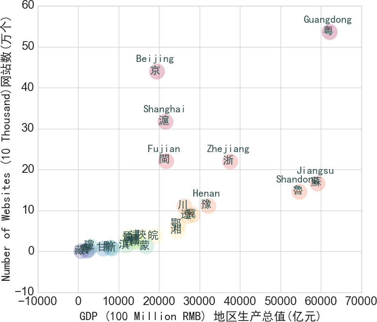

pyCHNadm1
=============

python scripts to load (CHN) People's Republic of China's datasets at province-level for research/analytics

The data selection and example graphs will be explained as [an exercise explained here in a blog post](http://people.oii.ox.ac.uk/hanteng/to.be.determined), researchers are encouraged to modify the codes for their own research questions.


#INSTALL

	pip install git+https://github.com/hanteng/pyCHNadm1.git

or

	pip install git+git://github.com/hanteng/pyCHNadm1.git


In the event that you don't have git installed, try this:

	pip install https://github.com/hanteng/pyCHNadm1/zipball/master


#Usage
1. run python
2. excute the following codes: Slicing the data on the year of 2013 on selected indicators
```
import pyCHNadm1

df_2013=CHN.CHNp[['GDP','IPop','websites'],:,2013]
df_2013.describe()
CHN.CHNmapping.loc["CN-11"]
CHN.CHNmapping['name_used']["CN-11"]
print CHN.CHNmeta['indicator']['GDP']

```

#Outcome
```
>>> df_2013.head()
              GDP  IPop  websites
geocode                          
CN-11    19500.56  1556     43.94
CN-12    14370.16   866      3.66
CN-13    28301.41  3389      8.96
CN-14    12602.24  1755      3.46
CN-15    16832.38  1093      1.23
>>> df_2013.describe()
                GDP         IPop   websites
count     31.000000    31.000000  31.000000
mean   20322.881935  1992.193548   9.351613
std    15597.425751  1424.858389  13.057604
min      807.670000   115.000000   0.090000
25%    12161.575000  1120.000000   1.340000
50%    16045.210000  1683.000000   3.660000
75%    25464.630000  2472.000000  11.065000
max    62163.970000  6992.000000  53.600000
>>> CHN.CHNmapping.loc["CN-11"]
name_used                      Beijing
name_gdam                      Beijing
name_zhs_one                         京
name_zhs_short                      北京
name_zhs                           北京市
FIPS                              CH22
ISO                              CN-11
GC                               GC_HB
8EZ               8EZ_Coastal_Northern
3ER                        3ER_Eastern
Name: CN-11, dtype: object
>>> CHN.CHNmapping['name_used']["CN-11"]
u'Beijing'

>>> print CHN.CHNmeta['indicator']['GDP']
地区生产总值(亿元)
```

#Visualization using seaborn
1. Install [seaborn for python](http://stanford.edu/~mwaskom/software/seaborn/) first

2. Then execute the following codes:

```
## Using 3ER to get the categorization of CHN regions
df_2013['3ER'] = [CHN.CHNmapping['3ER'][x] for x in df_2013.index]

g = sns.PairGrid(df_2013.reset_index(), hue="3ER")
g.map_diag(plt.hist)
g.map_offdiag(plt.scatter)  # sns.regplot (linear regression)
g.add_legend()              # Add legend
plt.show()

```


3. Then execute the following codes to focusing on the relationship between the number of websites (y-axis) to GDP (x-axis):

```
df=df_2013[['GDP','websites']]
df=df.sort([u'websites'], ascending=False)
df.columns=['x:GDP','y: websites']

def labelix(i,x):
    if i<8:
        return CHN.CHNmapping['name_used'][x]+'\n'+CHN.CHNmapping['name_zhs_one'][x]
    else:
        return '\n'+CHN.CHNmapping['name_zhs_one'][x]

# Labeling only the top 7 regions with English names
df.index=[labelix(i,x) for i,x in enumerate(df.index)] #English names + name_zhs_one

from matplotlib.font_manager import FontProperties
ChineseFont = FontProperties('SimHei')

from matplotlib import cm
cmap = cm.get_cmap('Spectral')

fig, ax = plt.subplots()
df.plot('x:GDP', 'y: websites', kind='scatter', ax=ax, s=560, linewidth=0, 
        c=range(len(df)), colormap=cmap, alpha=0.25)

ax.set_xlabel("GDP (100 Million RMB) "+CHN.CHNmeta['indicator']['GDP'],fontproperties = ChineseFont,fontsize=18,)
ax.set_ylabel("Number of Websites (10 Thousand)"+CHN.CHNmeta['indicator']['websites'],fontproperties = ChineseFont,fontsize=18,)

for k, v in df.iterrows():
    ax.annotate(k, v,
                xytext=(-3,10), textcoords='offset points',
                horizontalalignment='center', verticalalignment='center',
                fontproperties = ChineseFont, fontsize=16, color='darkslategrey')

fig.delaxes(fig.axes[1])  #remove color bar

plt.show()

```


